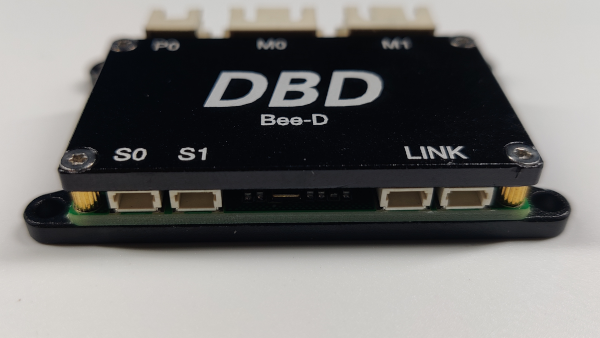
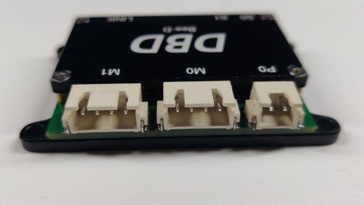
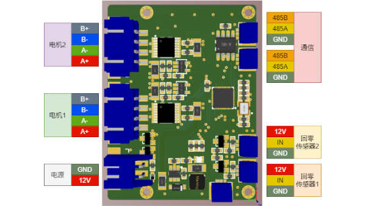

# 🐝 BeeD

**超小型双轴步进电机驱动控制器**

[English](#english) | [中文](#中文)

---

## 🏢 关于 DBD

DBD is a startup manufacturer of innovative matrix motion technologies, and as a manufacturer and developer of motor drives, controllers, and systems, DBD is designing its technology with emphasis on performance, efficiency, reliability, safety and simplicity.

DBD是一家专注于创新矩阵运动技术的初创制造商，作为电机驱动器、控制器和系统的制造商和开发商，DBD在设计技术时注重性能、效率、可靠性、安全性和简洁性。

## 🐝 关于 BeeD

Bee-D是DBD团队开发的一款**超小型创客神器**，尺寸仅有 **50mm × 38mm**。它采用ARM Cortex-M0内核的32位处理器，主频80MHz，内置双路步进电机驱动，运行空间矢量控制算法及动态力矩调节算法，可以完美控制2台42及以下型号小功率步进电机。

### ✨ 核心特性
- 🔧 **超小尺寸**: 50mm × 38mm，重量仅40g
- ⚡ **高性能**: ARM Cortex-M0，80MHz主频
- 🎯 **精确控制**: 256细分，空间矢量控制算法
- 🔌 **即插即用**: RS485总线通信，最高10Mbps
- 🌡️ **工业级**: -10°C至+60°C工作温度

## 📞 技术支持

如果您有任何问题，请随时联系我们：

**扫码添加微信获取技术支持**

## 📋 目录

- [🏢 关于 DBD](#-关于-dbd)
- [🐝 关于 BeeD](#-关于-beed)
- [📞 技术支持](#-技术支持)
- [📊 产品规格](#-产品规格)
  - [⚙️ 性能参数](#️-性能参数)
  - [🔍 产品细节](#-产品细节)
  - [📐 机械尺寸](#-机械尺寸)
  - [🔌 接口布局](#-接口布局)
- [🎮 运行模式](#-运行模式)
  - [🏠 回零模式](#-回零模式)
  - [📍 位置模式](#-位置模式)
  - [🔄 插补模式](#-插补模式)
- [👨‍💻 开发者资源](#-开发者资源)
  - [💻 BeeD Tuner](#-beed-tuner)
  - [📋 通信协议](#-通信协议)
  - [🐍 Python SDK](#-python-sdk)
- [🎬 相关视频](#-相关视频)

## 📊 产品规格

### ⚙️ 性能参数

| 🏷️ 属性 | 📊 参数值 |
|------|----|
| 重量 | 40g |
| 电机 | 4线2相步进电机 |
| 细分 | 256 |
| 工作电压 | DC12V |
| 最大持续输出电流 | 2x1.0A |
| PWM频率 | 20KHz |
| 输入IO | 2路(内部10K电阻上拉) |
| RS485总线 | 最高10Mbps,默认250Kbps |
| 运行温度 | -10 to +60摄氏度 |

### 🔍 产品细节

**正面视图**

**背面视图**

### 📐 机械尺寸

> **注意**: 机械尺寸图片文件缺失，请添加 `images/size.png` 文件

### 🔌 接口布局

**BeeD 接口布局示意图**

### 🔗 接线说明

> **注意**: 接线图文件缺失，请添加 `images/Connection.png` 文件

### 📡 传感器接口

- **输入IO**: 2路数字输入（内部10KΩ电阻上拉）
- **支持传感器类型**: 限位开关、光电开关、霍尔传感器等
- **电平要求**: 3.3V TTL电平兼容

## 🎮 运行模式

BeeD支持多种运行模式，满足不同应用场景的需求：

### 🏠 回零模式

**功能描述**: 自动回零定位功能

- 📍 根据设定的回零方向和目标速度开始运动
- 🎯 直到传感器触发，达到设置回零电平参数后停止运行
- 🔄 自动将运行模式恢复为进入回零模式前的运行模式
- ⚙️ 支持正向/反向回零，可调节回零速度

### 📍 位置模式

**功能描述**: 精确点位运动控制

- 🎯 用于精确的点到点运动控制
- ⏱️ 可设置加速时间、最大运行速度和目标位置
- 📊 支持绝对位置和相对位置控制
- 🔧 适用于定位、分拣、装配等应用

### 🔄 插补模式

**功能描述**: 同步位置插补模式

- 🤝 实现最多64轴电机的同步插补运动
- 📐 支持直线插补和圆弧插补
- 🎨 适用于连续轨迹运动控制
- 🛠️ **典型应用**:
  - 🖨️ 3D打印机
  - ✍️ 写字机、画图机
  - 🔨 雕刻机、点胶机
  - 🤖 多轴联动设备

## 👨‍💻 开发者资源

### 💻 BeeD Tuner

**Windows 调试工具**

*适用于 Windows 系统的 BeeD 调试和配置工具*

### 📋 通信协议

**完整的通信协议文档**

*详细的 RS485 通信协议说明文档*

### 🐍 Python SDK

**Python 开发包**

*完整的 Python 开发包，包含示例代码和API文档*

---

## 🎬 相关视频

### 📺 演示视频

**Bee-D单板双轴电机驱动-8轴联动展示**

---

## 🤝 加入我们

**感谢您对 BeeD 的关注！**

如果您在使用过程中遇到任何问题，或者有任何建议和想法，

欢迎通过微信联系我们，我们将竭诚为您服务！

---

*Made with ❤️ by DBD Team*

