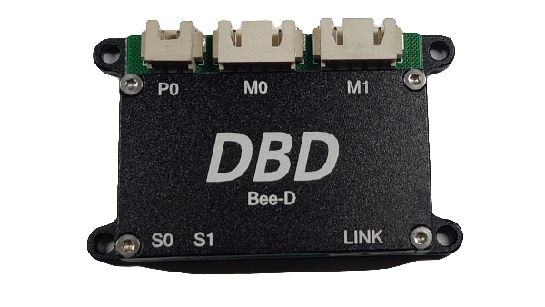

# Bee-D

## 简介

Bee-D是DBD团队开发的一款超小型创客神器,尺寸只有50mm x 38mm, 它采用ARM Cortex-M0内核的32位处理器, 主频80MHz, 内置双路步进电机驱动,运行空间矢量控制算法及动态力矩调节算法, 可以完美控制2台42及以下型号小功率步进电机.

## 资源特性

| 属性 | 值 |
|------|----|
| 重量 | 40g |
| 电机 | 4线2相步进电机 |
| 细分 | 256 |
| 工作电压 | DC12V |
| 最大持续输出电流 | 2x1.0A |
| PWM频率 | 20KHz |
| 输入IO | 2路(内部10K电阻上拉) |
| RS485总线 | 最高10Mbps,默认250Kbps |
| 运行温度 | -10 to +60摄氏度 |

## 产品细节

## 机械尺寸

## 接口布局

## 接线图

## 传感器接口

### 两脚触碰开关

### 三脚触碰开关

### 光电传感器

### 霍尔传感器

## 运行模式

| 模式 | 描述 |
|------|------|
| 回零模式 | 进入回零模式后,根据设定的回零方向和目标速度开始运动,直到传感器触发,达到设置回零电平参数后停止运行,并且自动将运行模式恢复为进入回零模式前的运行模式. |
| 插补模式 | 插补模式全称同步位置插补模式,用于实现最多32轴电机的同步插补运动.该模式通常用于3D打印机,写字机,画图机,雕刻机,点胶机等需要多轴联动,并且执行连续轨迹的设备. |

## 开发者

### BeeD Tuner for Windows

### 通信协议

[点击下载](downloads/BeeD通信协议V050114.xls)

### Python SDK

## 相关视频

## 关于DBD

DBD是一家创新矩阵运动技术初创制造商,作为电机驱动器、控制器和系统的制造商和开发者,DBD在设计其技术时强调性能、效率、可靠性、安全性和简单性。